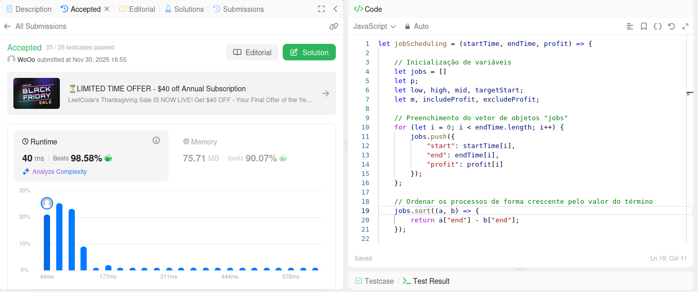

# PD_LeetCode_Dupla13

**Número da Lista**: 5 
**Conteúdo da Disciplina**: Programação Dinâmica 

## Alunos

|Matrícula | Aluno |
| -- | -- |
| 222006490 | Vinícius de Jesus Bessa Fernandes |
| 231011865 | Willian Wagner Xavier Ramos da Silva |

## Sobre

O trabalho realizado pela dupla 13 no módulo de programação dinâmica consiste na resolução de ** exercícios, sendo eles de dificuldade média ou difícil.

As seções abaixo informam a dificuldade de cada questão, linguagens utilizadas e os seus respectivos prints para confirmação da submissão.

## Exercícios
| Nome | Dificuldade |
| -- | -- |
| [1235. Maximum Profit in Job Scheduling](https://leetcode.com/problems/maximum-profit-in-job-scheduling/description/)  |  Difícil |
| [xxx. Name](https://leetcode.com/problems/name-of-question/description/)  |  Média/Difícil |
| [xxx. Name](https://leetcode.com/problems/name-of-question/description/)  |  Média/Difícil |

## Screenshots
[Adicione 1 screenshot da questão.]: #
### Exercício 1235. Maximum Profit in Job Scheduling (Difícil)

### Exercício xxx. Name of Question (Média/Difícil) 

### Exercício xxx. Name of Question (Média/Difícil)

## Linguagens 
[**Linguagem**: xxxxxx ]: #
[**Framework**: (caso exista)]: # 
[Descreva os pré-requisitos para rodar o seu projeto e os comandos necessários.]: #
JavaScript e Python

## Vídeo
[Explique como usar seu projeto caso haja algum passo a passo após o comando de execução.]: #

[Vídeo de explicação das soluções de cada exercício](https://youtu.be/#######)
